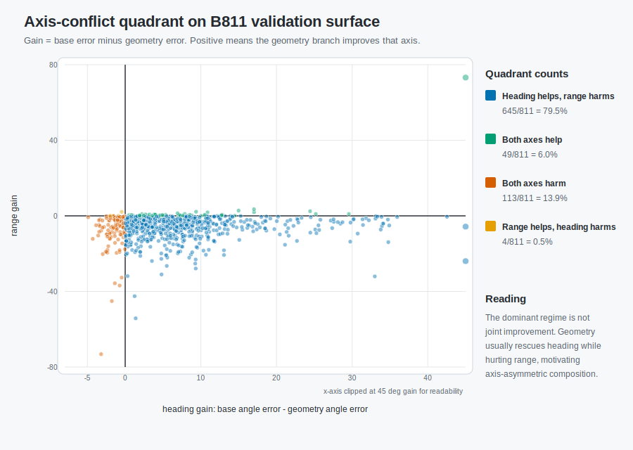
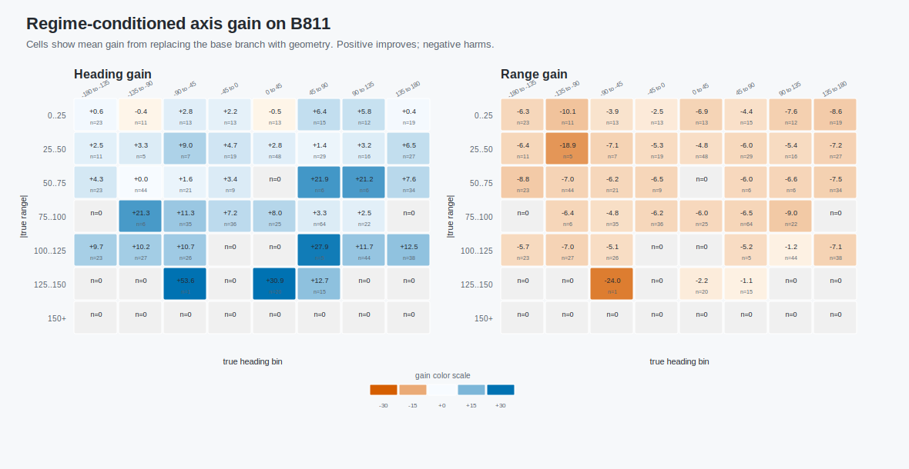
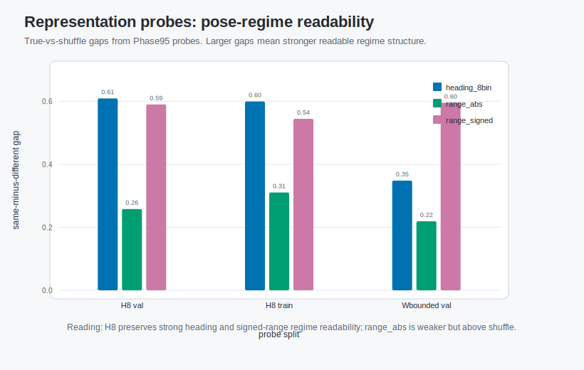
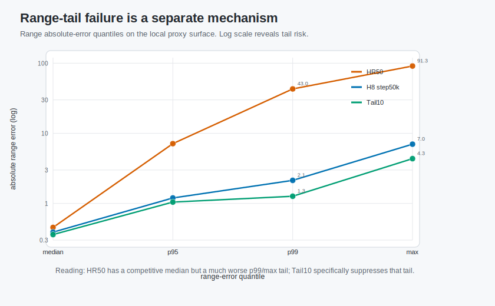

# Mechanism Insights And Representation Evidence

[中文说明](MECHANISM_INSIGHTS.zh-CN.md)

This document summarizes the mechanism evidence behind the final design. The
central conclusion is axis asymmetry, not hard factor independence.

Generated summary figure:

```text
figures/fig_mechanism_summary.svg
figures/fig_source_adaptation_summary.svg
figures/fig_val_qualitative_cases.svg
figures/fig_val_axis_gradcam.png
figures/fig_val_axis_gradcam.svg
figures/fig_val_patch_occlusion_axis_sensitivity.png
figures/fig_val_patch_occlusion_axis_sensitivity.svg
figures/fig_axis_conflict_quadrant.svg
figures/fig_regime_conditioned_axis_gain.svg
figures/fig_representation_probe_summary.svg
figures/fig_range_tail_failure_quantiles.svg
```

Generation script:

```text
figures/gen_fig_mechanism_summary.py
figures/mechanism_summary_data.csv
figures/gen_fig_source_adaptation_summary.py
figures/source_adaptation_summary_data.csv
figures/gen_fig_val_qualitative_cases.py
figures/val_qualitative_cases.csv
figures/gen_fig_val_axis_gradcam.py
figures/val_axis_gradcam_summary.csv
figures/val_axis_gradcam_summary.json
figures/gen_fig_val_patch_occlusion_axis_sensitivity.py
figures/val_patch_occlusion_axis_sensitivity_summary.csv
figures/val_patch_occlusion_axis_sensitivity_summary.json
figures/gen_fig_axis_mechanism_deep_dive.py
figures/b811_base_geometry_surface.csv
figures/b811_anchor_val_predictions.csv
figures/split_fusion_train_val_predictions.csv
figures/axis_conflict_quadrant_summary.csv
figures/regime_conditioned_axis_gain.csv
figures/representation_probe_summary.csv
figures/range_tail_failure_quantiles.csv
```

The broader inventory of external source adaptation and split-fusion results is
in [SOURCE_ADAPTATION.md](SOURCE_ADAPTATION.md).

## How To Read The Evidence

The figures and tables in this document are organized around one mechanism
question: do heading and distance behave like two interchangeable coordinates
of one regression target, or do they expose heterogeneous evidence and failure
patterns? The evidence supports the second view, with an important boundary:
the axes are not claimed to be fully independent latent factors.

| evidence type | artifact | mechanism role |
|---|---|---|
| Regime-level difficulty | information-solvability split probes | shows that heading-vs-distance difficulty changes with the split regime |
| Pair-level source conflict | B811 axis-conflict quadrant | shows geometry can help heading while harming distance on the same pair |
| Image-space evidence use | GradCAM and patch-occlusion figures | shows the same H8 model can use different target-view regions for the two axes |
| Validation composition | ADPA axis-decoupled surface | shows heading and distance can be recombined from different evidence streams |
| Representation audits | Phase95 probe summaries | supports shared pose-regime readability but rejects hard subspace independence |
| Range-tail diagnostics | HR50/H8/Tail10 quantiles | shows tail robustness is a range-specific optimization issue |

## Insight 1: Heading And Distance Fail Differently Across Regimes

The information-solvability probing run used frozen match-observability proxies
across multiple split families. It showed that heading and distance do not have
a fixed difficulty ordering:

| split | role | heading minus range mean | heading over range mean | reading |
|---|---|---:|---:|---|
| `group_control_split_v1` | control | 10.45 | 1.34 | heading harder than distance |
| `pair_name_heldout_split_v1` | intermediate | 9.38 | 1.30 | heading harder than distance |
| `delta_heldout_split_v1` | prior-break | 2.36 | 1.07 | heading and distance nearly coupled |
| `extreme_delta_split_v1` | stress | -28.96 | 0.65 | distance much harder than heading |

This supports a regime-dependent polar-axis view: a single global hardness
score is not enough to explain PairUAV behavior.

## Insight 2: Geometry Utility Is Axis-Asymmetric

The B811 comparable-surface diagnostic compared base and geometry outcomes on
the same validation pairs. The geometry source was mostly useful for heading
and harmful for distance:

Direct lower-error comparison counted geometry heading better on `694/811`
pairs and geometry distance worse on `758/811` pairs. The table below uses the
stricter helpful/neutral/harmful binning used by the mechanism summary figure.

| axis | geometry helpful | neutral/tie | geometry harmful | dominant behavior |
|---|---:|---:|---:|---|
| heading | 608 | 135 | 68 | geometry helps |
| distance | 10 | 136 | 665 | geometry harms |

Pair-level regime counts further showed:

| pair regime | count |
|---|---:|
| heading_helpful_distance_harmful | 492 |
| base_sufficient_candidate | 189 |
| joint_geometry_helpful | 117 |
| joint_geometry_harmful | 13 |

This result directly motivated axis-decoupled composition and protected metric
paths.

The full B811 axis-conflict quadrant makes the same point more directly:



Using the direct gain definition `base error - geometry error`, `645/811`
pairs fall in the dominant quadrant where geometry helps heading but hurts
range. Only `49/811` pairs are joint improvements, and only `4/811` pairs are
range-helpful while heading-harmful. This is stronger than a mean-metric
argument because the trade-off appears at the pair level.

The regime-conditioned view shows that these gains also depend on the true
heading and absolute-range regime:



The two heatmaps use the same B811 rows but aggregate them differently:
heading-gain cells and range-gain cells have different signs and magnitudes
across pose regimes. This supports a regime-dependent polar-axis view rather
than a single global geometry-quality score.

The release also includes a reproducible validation-case manifest for
qualitative inspection. The checked-in SVG is self-contained and embeds the
selected validation images. To regenerate it from the manifest, provide the
official `train_tour` root:

```bash
python figures/gen_fig_val_qualitative_cases.py \
  --manifest figures/val_qualitative_cases.csv \
  --dataset-root /path/to/pairUAV/train_tour \
  --output figures/fig_val_qualitative_cases.svg \
  --embed-images
```

For image-space evidence, we additionally provide target-aligned output-gradient
activation maps from the H8 mid-late checkpoint. For each validation pair, the
script backpropagates the target-aligned heading output and signed distance
output on the target view, then visualizes heading heatmap, distance heatmap,
and their absolute difference on top of the validation image. The same script
can also produce loss-gradient maps with `--gradient-target loss`.


```bash
python figures/gen_fig_val_axis_gradcam.py \
  --repo-root /path/to/reloc3r_pairuav \
  --json-root /path/to/val_json \
  --image-root /path/to/pairUAV/train_tour \
  --checkpoint /path/to/H8_mid_late/checkpoint-final.pth \
  --case-manifest figures/val_qualitative_cases.csv \
  --gradient-target target_aligned_output \
  --output-png figures/fig_val_axis_gradcam.png \
  --output-svg figures/fig_val_axis_gradcam.svg \
  --summary-csv figures/val_axis_gradcam_summary.csv \
  --summary-json figures/val_axis_gradcam_summary.json
```

Across the four checked-in validation examples, the average top-20% activation
overlap between heading and distance maps is `0.241`, with examples ranging
from almost no overlap (`0.001`) to partial overlap (`0.543`). The average
absolute normalized-map difference is `0.540`. This is spatial evidence for
axis-specific evidence use inside the same H8 model. It should be read as
gradient-based spatial evidence, not as a causal masking proof.

We also include a stronger perturbation-style visualization. Instead of
backpropagating gradients, the patch-occlusion script masks one target-view
patch at a time and measures how much the H8 heading output and range output
change:


```bash
python figures/gen_fig_val_patch_occlusion_axis_sensitivity.py \
  --repo-root /path/to/reloc3r_pairuav \
  --json-root /path/to/val_json \
  --image-root /path/to/pairUAV/train_tour \
  --checkpoint /path/to/H8_mid_late/checkpoint-final.pth \
  --case-manifest figures/val_qualitative_cases.csv \
  --case-groups axis_conflict,joint_helpful \
  --grid 4 \
  --mask-mode zero \
  --device cpu \
  --output-png figures/fig_val_patch_occlusion_axis_sensitivity.png \
  --output-svg figures/fig_val_patch_occlusion_axis_sensitivity.svg \
  --summary-csv figures/val_patch_occlusion_axis_sensitivity_summary.csv \
  --summary-json figures/val_patch_occlusion_axis_sensitivity_summary.json
```

Across the four checked-in occlusion examples, the average top-20% sensitivity
overlap is `0.360`, ranging from `0.000` to `0.707`. This should still be read
as perturbation evidence rather than a complete causal proof, but it is less
dependent on local gradients than the activation-map figure.

The split-fusion predecessor showed the same axis specialization under a
source-adaptation protocol:

| probe | heading source | distance source | angle MAE | distance MAE | proxy |
|---|---|---|---:|---:|---:|
| old-field baseline | old field | old field | 1.393762 | 39.247571 | 0.182955 |
| rich VGGT only | rich VGGT | rich VGGT | 2.835736 | 33.045150 | 0.163277 |
| split-fusion | old-field concat | rich three-source | 1.330926 | 4.024406 | 0.025360 |

This was not used as the final submitted route, but it is important mechanism
evidence: source utility improved when heading and distance were routed through
different evidence streams.

## Insight 3: Axis-Decoupled Composition Works On A Validation Surface

ADPA-1 repaired a prediction-surface contract blocker and then tested a simple
axis composition:

```text
heading = geometry-assisted heading
distance = base distance
```

The validation result was:

| variant | heading MAE | distance MAE |
|---|---:|---:|
| base only | 8.6087 | 0.9876 |
| geometry only | 1.7769 | 6.9755 |
| axis-decoupled | 1.7769 | 0.9876 |

This supports the design principle but not a deployable selector by itself. The
base-sufficient slice still needs control protection because geometry heading is
not always better.

## Insight 4: Representation Evidence Supports Shared Pose-Regime Readability

Phase95 representation audits tested whether H8 representations encode
pose-regime information beyond shuffled-label artifacts.

H8 final val811 true-vs-shuffle gaps:

| regime label | true score | shuffle mean | true-minus-shuffle |
|---|---:|---:|---:|
| heading_8bin | 0.608408 | -0.000625 | 0.609033 |
| range_abs_bucket | 0.253464 | -0.004357 | 0.257820 |
| range_signed_bucket | 0.578852 | -0.010970 | 0.589821 |

The same phenomenon remained stable on train811. H8 final strengthened
heading-regime structure relative to Wbounded H8, while signed-range structure
was already strong in Wbounded H8.



However, Phase95-R2 subspace-overlap did **not** support the stronger claim that
heading and range live in non-overlapping linear subspaces. Cross/self ratios
were greater than 1 in the tested metric. The correct conclusion is therefore:

```text
shared pose-regime representation with coordinate-specific readability
```

not:

```text
hard heading/range latent disentanglement
```

## Insight 5: Tail Robustness Is A Separate Range Mechanism

PAAER HR50 failed mainly through high-absolute-range tails rather than global
range calibration:

| run | range median | p95 | p99 | max |
|---|---:|---:|---:|---:|
| HR50 | 0.4546 | 7.1223 | 42.9710 | 91.2856 |
| H8 step50k | 0.3897 | 1.1979 | 2.1321 | 6.9968 |
| Tail10 | 0.3600 | 1.0446 | 1.2653 | 4.3494 |



This is why the final route did not simply run longer. It introduced
tail-weighted range training and then used deterministic range stacking.

## Paper-Facing Interpretation

The release supports this mechanism statement:

```text
PairUAV polar localization contains a shared pose-regime representation, but
heading and distance expose different evidence utility, optimization behavior,
and tail-risk profiles. A strong system should preserve stable metric evidence
while allowing axis-specific readout and calibration.
```

The release does not claim:

- hidden official-test labels were used for postprocessing;
- pair ID directly determines distance;
- heading and distance are fully independent latent factors;
- the final score is produced by one end-to-end model without deterministic
  postprocess.
